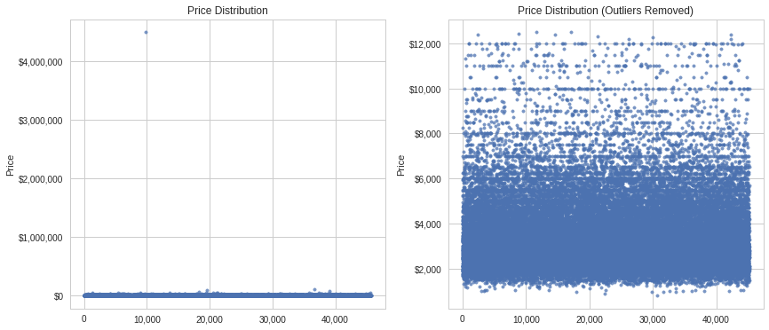
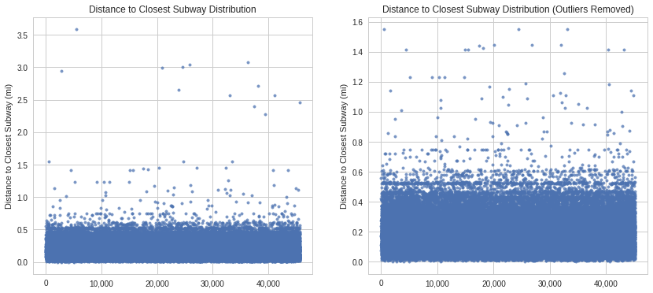
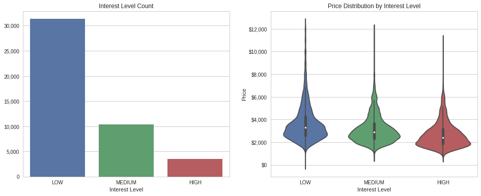
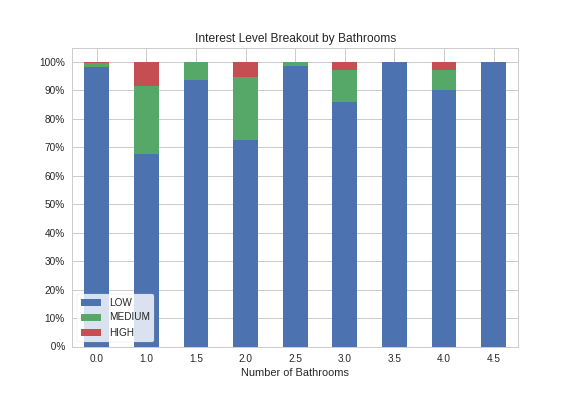
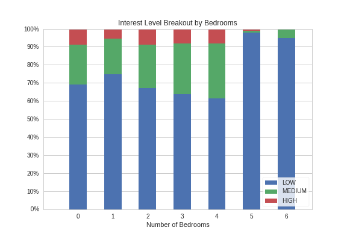
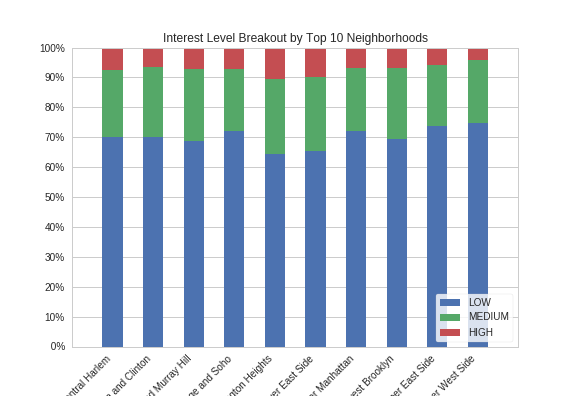
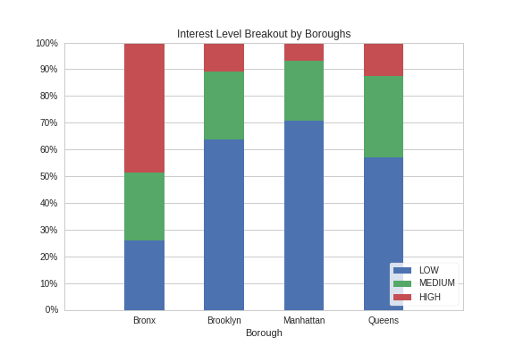
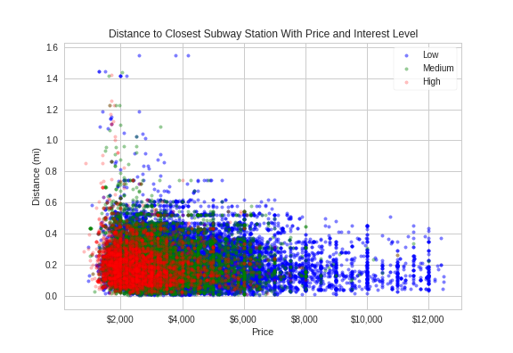
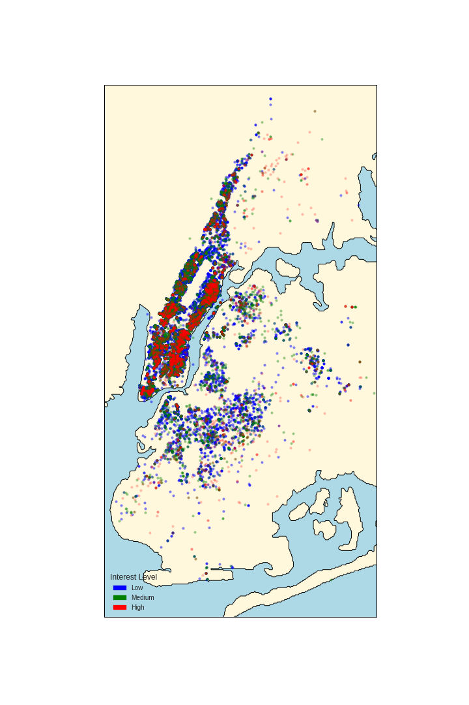

# **EDA Project - NYC Rental Listing**

## Introduction

This project is based on the NYC Rental Listing Kaggle challenge. The original goal of the competition was to predict the number of inquiries a new listing would receive based on various data points. For this project, however, the data will be utilized to complete an exploratory data analysis.

## Goals

The goal of this analysis is to clean and analyze the data in order to answer the following questions:

1. *What determines the interest level of a property?*
2. *How does proximity to Subways influence a rental's price or interest level?*

## Assumptions

The data set being used was provided by Two Sigma and RentHop and the various variables are assumed to be accurate and correct. The price variable is assumed to be monthly rental price and not a purchase price. All listings are assumed to be residential with accurate geographical variables (latitude and longitude).
   
Finding an apartment in New York City is a difficult task and differs from other large U.S. cities due to more people renting than purchasing homes. Unlike other cities where as an individual ages the more likely they are to own a home; in New York, renters substantially outpace buyers well into their 40s. Due to the large span of potential renters (age, life stage, income, etc.), the rental properties available have a large range as well, where monthly rental prices can range from $2,500 month to $30,000 a month. With this in mind, the data set in use has some outliers in price and property size (measured by number of bathrooms and bedrooms). The researcher took some liberties removing various outliers in order to create a more comparable data set.

## Approach

The approach here was to clean any data necessary and then perform a variety of standard EDA techniques to examine the data. In addition to the data provided, some additional fields were required to provide for a more robust analysis. These additional fields are the zip code of the property (which was used to attach the property to a borough and neighborhood) as well as the distance to the nearest subway station. Both of these data points were created via functions using the GeoPy package within Python. Once all the data was available further examination was performed to assess any outliers or other erroneous or null values.

## Analysis

### *Data Cleaning*

There were 15 fields provided in the original data set, ranging in type from numerical to text. For this analysis the key fields used from the data set were:
1. Number of bathrooms (including half baths) - *bathrooms*
2. Number of bedrooms - *bedrooms*
3. Display Address - *display_address*
4. Interest Level (HIGH, MEDIUM, LOW) - *interest_level*
5. Geographic Location - *latitude & longitude*
6. Monthly Rental Price - *price*
7. Street Address - *street_address*

The original dataset had a total of 49,352 rows. From some cursory examination various outliers for key data fields exist as well as some missing data that required removal. Zip codes were acquired using reverse location within the GeoPy package. These zip codes were then used to locate each property within a particular neighborhood and borough. Some zip codes were unable to be obtained and thus removed in order to provide consistent analysis among all data points. When examining price, there is evidence of a few outliers on both ends of the spectrum. Outliers greater than the 99th percentile as well as a few outliers with abnormally low prices (less than $500) were removed from the data set with the assumption they were erroneous.
   

  

   
Next, the distance to the closest subway station was examined. Again, there were outliers to be removed. There was an obvious break around 2 miles from the nearest subway station. These outliers are more than likely out of the main New York City area and therefore comparing subway distance for them would not provide any robust information.
   

  

   
After removing the preceding outliers, the dataset was left with 45,181 data points. From here the number of bedrooms and bathrooms was examined. There were a handful of data points that were assumed to be erroneous (*i.e.* 10 bathrooms or 8 bedrooms when the next highest was much lower). After removal of outliers related to bedroom and bathroom count, the final data set used for analysis had 45,168 data points.

### *Data Exploration*
The first question explores what determines the interest level for a particular property. The independent variables in question here are number of bedrooms, number of bathrooms, the distance to the closest subway, as well as a look at the effect of a properties location (*i.e.* neighborhood or borough). First, a quick glance at the dependent variable, interest level. The data for interest level is heavily skewed towards low interest level properties, with nearly 70% of the properties falling into the low interest category and less than 8% having a high interest level. Using a violin plot we can compare price and interest level. Here, lower priced properties do appear to be correlated with a higher interest level, however, the means and inner-quartile ranges for low, medium and high properties overlap too much to disregard other key influencing factors.
   

  

   
Next we examine if the number of bedrooms or bathrooms has an effect on interest level. Concerning bathrooms, from the stacked bar chart below we can see that 1 and 2 bathrooms are the most popular, with roughly 30% of rental properties with 1 or 2 bathrooms have an interest level of medium or higher. It also appears that half baths are not that sought after, with any half bath having no high interest levels .
   

  

   
Examining bedrooms, 0 (studio) to 4 bedrooms appear to be the most popular, with 30%-40% of these properties showing at least a medium interest level, while properties with greater than 5 bedrooms have less than a 10% chance of showing a medium or higher interest level.
   

  

   
We next look at neighborhoods and boroughs. There are 36 neighborhoods represented in this data set and 4 of the 5 boroughs. If we examine just the top 10 most popular neighborhoods, we can see that almost 30% of the properties in each of them have an interest level of medium or higher.
   

  

   

Examining the boroughs, it appears that the Bronx has by far the highest interest level, with almost 70% of its properties having a medium interest level or higher. While Queens is next with more than 40% of its properties having a medium interest level or higer.

   

   
New York City is one of the most walkable cities in the world, with very few of its inhabitants requiring the use of a car. One of the reasons the city is so walkable is its vast subway system. Here we will examine whether or not the distance to the nearest subway station, in conjunction with price, have an impact on the interest level of a particular property. Looking at the chart below properties with high interest levels are clustered more to shorter distances to the nearest subway as well as lower prices. While, as price and distance to the nearest subway increases, the interest level tends to drop.
   

  

   
Below is a map of New York City showing the location of all the properties by interest level.
   

  

   
## Conclusions and Further Analysis
The previous findings create a good scaffold for further analysis for predicting property interest levels in New York City. Some additional factors to include could be quality of nearby schools for families with children, as well as neighborhood crime statistics, although both of these could potentially be captured within the neighborhood or boroughs variables themselves. Based on the parameters of this project there is evidence to support the claim that the number of bedrooms and bathrooms, in addition to price, neighborhood, and the distance to the closest subway, all impact the interest level of a rental property in New York City. Further examination could include applying a numerical value to interest level and performing a regression analysis using bedroom and bathroom count, price, subway distance, and neighborhood and borough (as dummy variables) as independent variables.  
